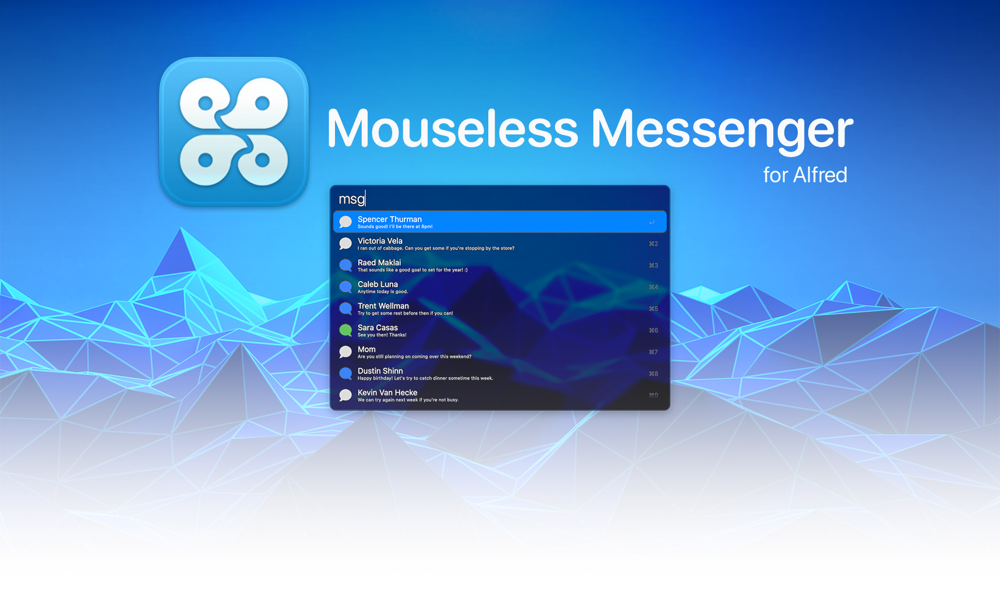

# Mouseless Messenger

Mouseless Messenger offers you rapid keyboard-driven access to send and read conversations in the macOS Messages app via Alfred — all without ever interacting with the Messages app.

<b><a href="https://github.com/stephancasas/alfred-mouseless-messenger/releases/latest">Click Here to Download the Latest Release</a></b>

## Installation

Before the workflow can be used, you'll need to provide Alfred with _Full Disk Access_ privileges via System Preferences:

1. Open System Preferences
2. Choose _Security and Privacy_
3. Choose _Privacy_
4. Select _Full Disk Access_
5. Unlock the 🔒 in the bottom left corner.
6. Enable the checkbox for **Alfred** or use the ➕ button to add Alfred.

### **Privilege Escalation**

Full Disk Access is used to provide Alfred with access to the Messages database. However, by providing Alfred with this access, you are providing **ALL** Alfred workflow with access — not just Mouseless Messenger.

Be sure you trust your installed workflows before allowing this.

## Usage

The workflow is triggered by the keyword `msg`. On run, you'll be provided with your eight (8) most recent conversations in the Messages app.

- To preview a message thread, press the **SHIFT** key while a conversation is selected.

- To reply to a message thread, press the **ENTER** or **RETURN** key while a conversation is selected, then type your reply in the provided input space and press **ENTER** to send it.

  - In order for the message to send, the Messages app must be running in the background. The window doesn't need to be in the foreground (or even visible), but the app itself must be running.

- To export the conversation preview as an HTML document, hold the **OPTION** key while pressing the **ENTER** or **RETURN** key. The conversation preview will be exported to your Downloads folder.

- To export the conversation preview as a PDF document, hold the **COMMAND** key while pressing the **ENTER** or **RETURN** key. The conversation preview will be exported to your Downloads folder.
  - Google Chrome must be installed to use this feature.

## Support the Workflow

I built Mouseless Messenger because I code all day and don't like to take my hands off the keyboard. If you find it useful, please consider [buying me a coffee](https://buymeacoffee.com/stephancasas) so that I can keep building cool things like this.

If you have a feature you'd like added, or an issue which needs attention, please [open an issue here on GitHub](https://github.com/stephancasas/alfred-mouseless-messenger).

## License

MIT — Hell yeah, free software!
